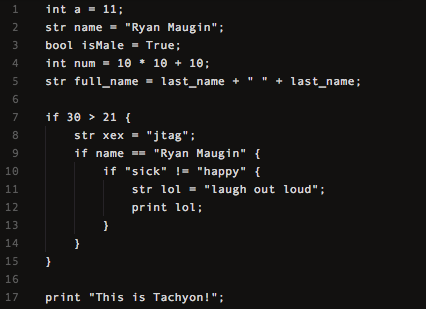

# Tachyon ☄️

> `Note:` There are a lot of comments since this is the first time I programme programming a toy language and it is part of my learning process so that I can make a better language next time.

This is a performance focused language which tries to be an all in one with multiple ways to do everything like defining a function could be done using syntax of many different languages but has a distinct and explicit syntax for itself.

# Tachyon Code Preview `v1.0`

> A preview of the syntax which tachyon supports in version `1.0`

# Installation

**Mac & Linux**
1. Clone this repo into `~/Users/mac/Library` using `git clone https://github.com/RyanMaugin/Tachyon.git Tachyon`.
2. Once installed go inside the Tachyon folder by entering `cd Tachyon` in your terminal.
3. Run the `setup.py` script using `python3 setup.py`.
4. Your done! You can run tachyon code by using the following command `tachyon fileName.tn`.

**Windows Coming Soon!**

# Roadmap
- **Front-end**
    - [x] Create Lexical analyzer
    - [x] Create Parser

- **Backend**
    - [x] Code genration
    - [ ] Optimisation `current`
    
- **Extra**
    - [ ] Write all docmentations in detail
    - [ ] Tachyon IDE
    - [ ] Linter & Editor plugins

# Author

🤖 [Ryan Maugin](https://ryanmaugin.github.io)

🐦 [@techedryan](https://www.twitter.com/techedryan)

📨 ryan.maugin@adacollege.org.uk
